

 

<h3 align="center">🛍️ 🛒 Next.js 15 E-Commerce Website — Modern Full-Stack Online Store</h3>

This project is a production-grade <b>eCommerce platform built with Next.js 15 (App Router)</b>, engineered for scalability, performance, and modern web standards. The application leverages a component-driven architecture with <b>React</b>, styled using <b>Tailwind CSS</b>, <b>Material UI (MUI)</b>, and <b>Radix UI</b> to deliver a highly responsive, accessible, and maintainable user interface.

  

The backend infrastructure is powered by <b>MongoDB</b> with <b>Mongoose</b> for efficient schema modeling and database interactions. Secure user authentication and protected application routes are implemented using <b>JWT-based authentication</b>, enabling reliable session management and role-based access for both users and administrators.

  

The platform includes a fully functional <b>Admin Dashboard</b> that allows administrators to manage products, orders, and users through a structured and intuitive interface. Rich product descriptions are supported through <b>CKEditor 5</b>, enabling dynamic content creation and enhanced product presentation.

  

For modern data management and optimized client-server communication, the application integrates <b>React Query</b> for efficient server-state caching, background refetching, and API synchronization, while <b>Redux Toolkit</b> is used to manage complex global application state.

  

Payments are securely processed through <b>Stripe</b>, providing a reliable and scalable payment infrastructure suitable for production environments. Media assets such as product images are managed using <b>Cloudinary</b>, ensuring optimized image delivery and cloud-based storage.

  

Built with clean architecture principles and modern development practices, this project demonstrates a real-world eCommerce implementation suitable for production deployment, client solutions, or advanced developer portfolios.

## 📸 Screenshots

| Page                          | Screenshot                                                    |
| ----------------------------- | ------------------------------------------------------------- |
| 🏠 Home Page                  | 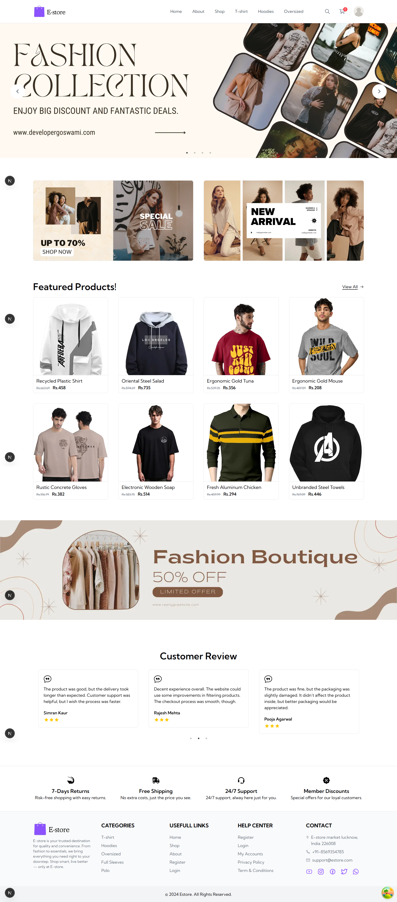                     |
| 🛍️ Shop Page                  | 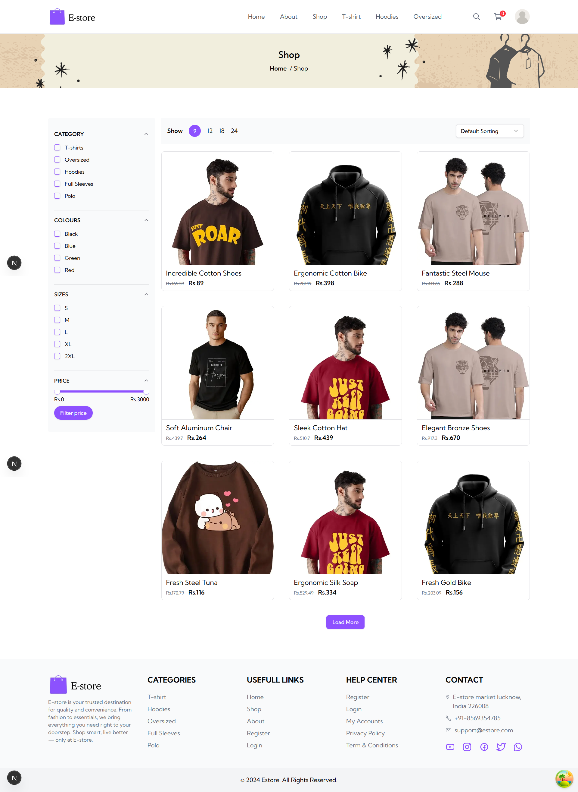                     |
| 📦 Product Details            | 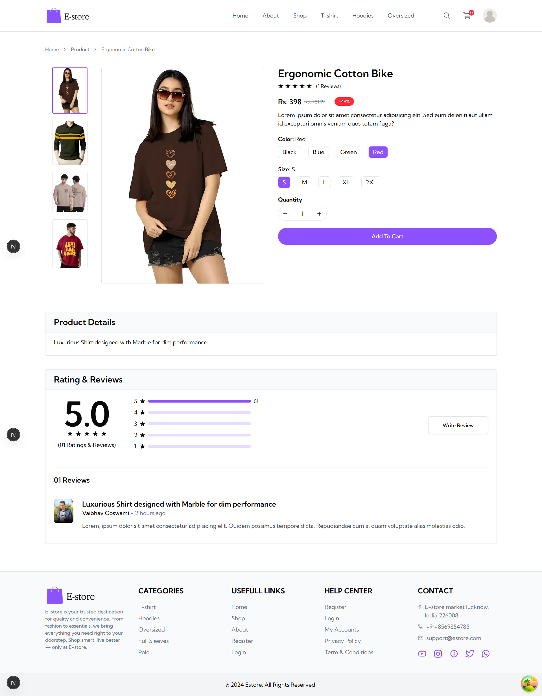         |
| 🛒 Cart Page                  | 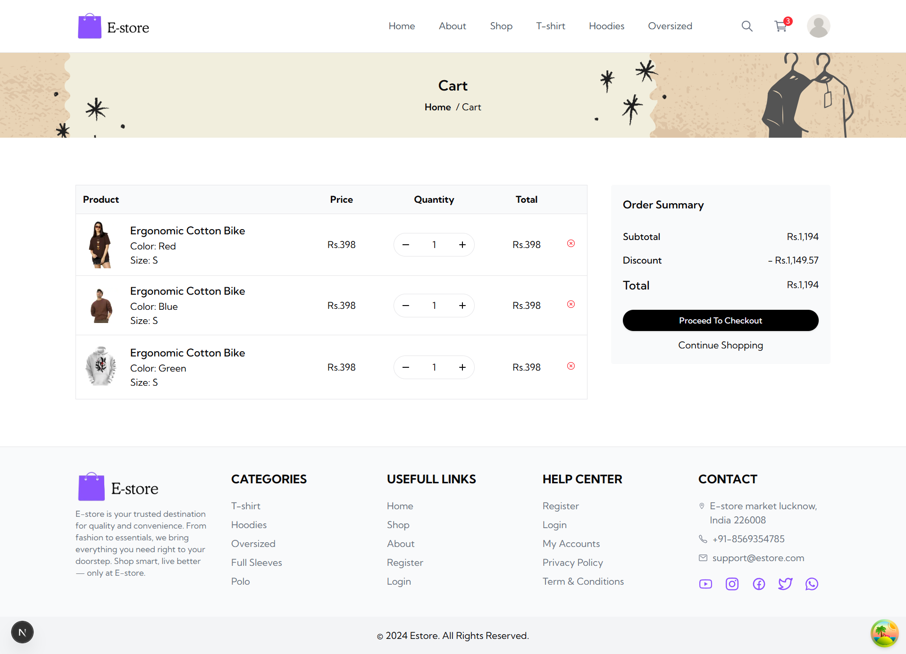                     |
| 💳 Checkout Page              | 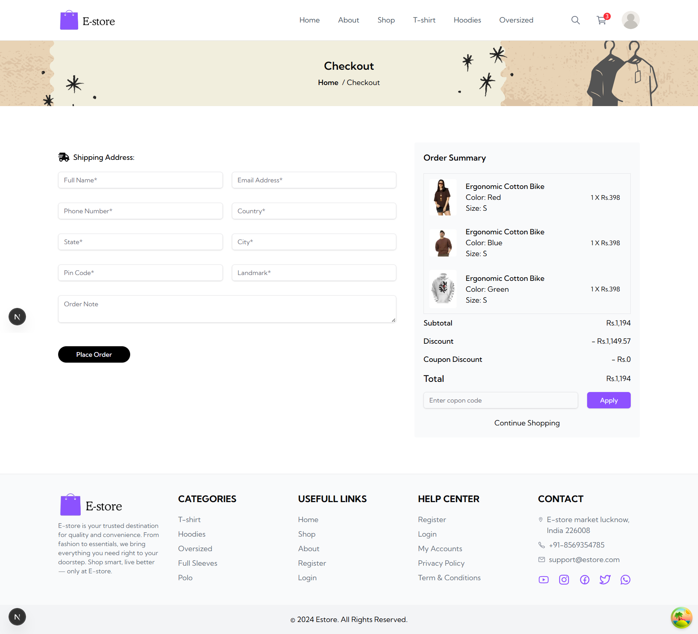             |
| 📊 Admin Dashboard (Dark)     | 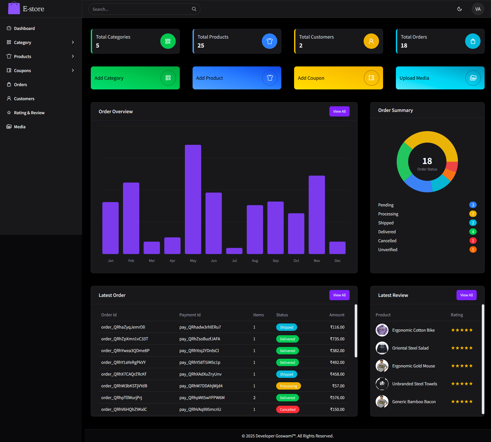          |
| 📊 Admin Dashboard (Light)    | 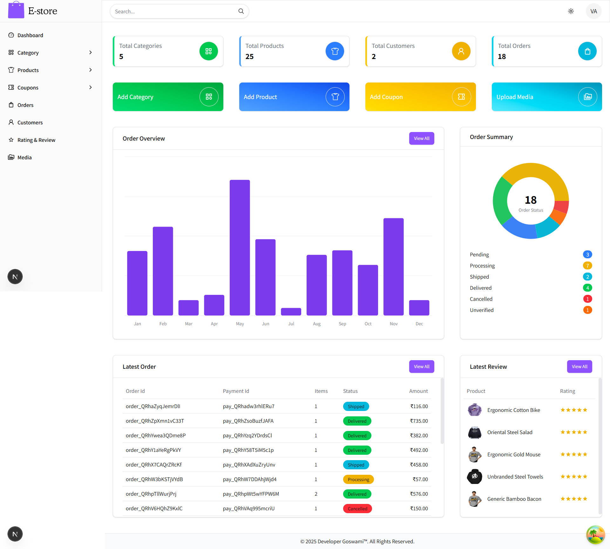         |
| 📷 Media Gallery (Dark)       | 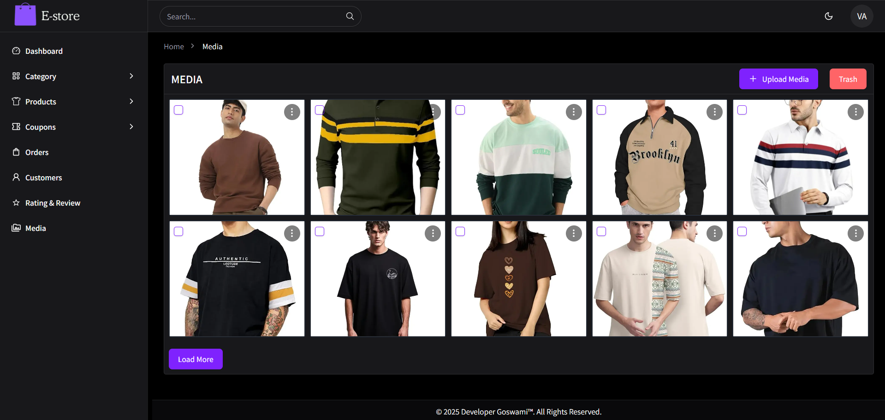                        |
| 📷 Media Gallery (Light)      | 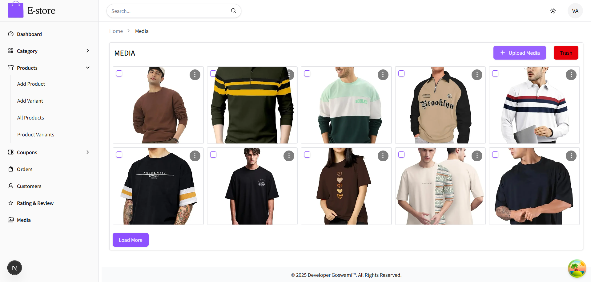                 |
| 🗂️ Product Management (Dark)  | 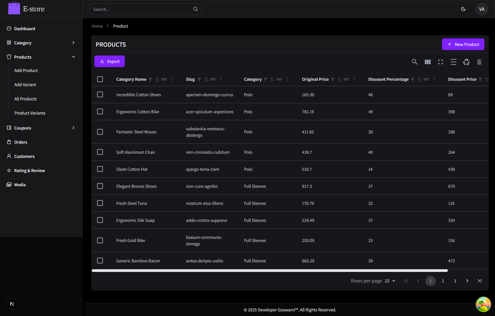          |
| 🗂️ Product Management (Light) | 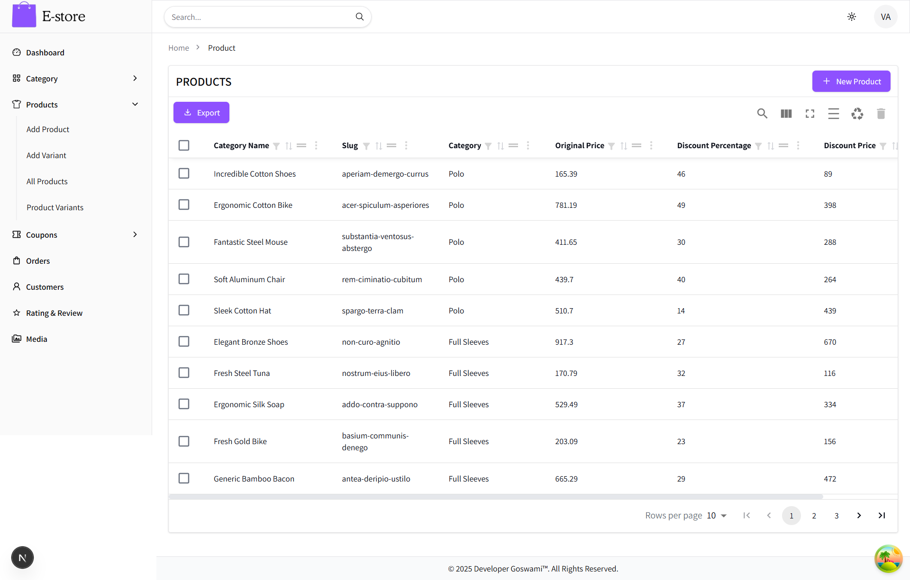   |
| 🧾 Order Details (Dark)       | 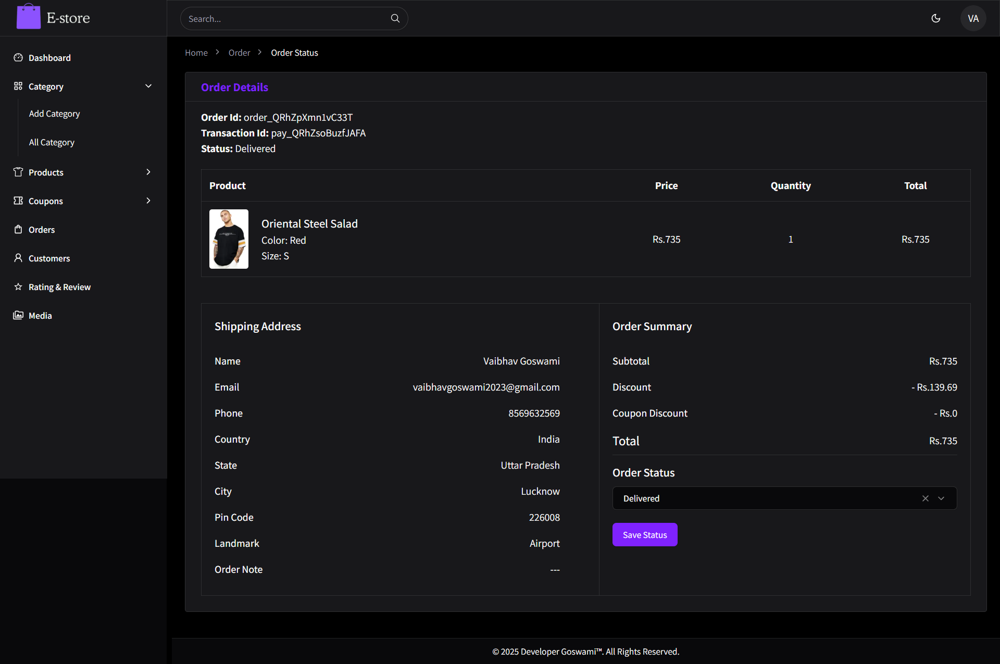        |
| 🧾 Order Details (Light)      | 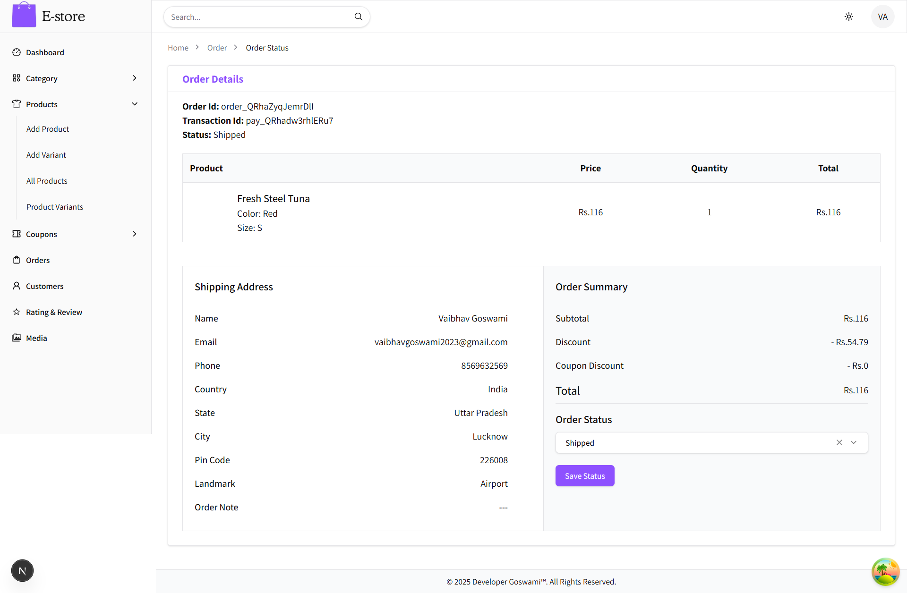 |

## 📋 <a name="table">Table of Contents</a>

1. 🙋 [About the Creator](#about-the-creator)
2. 🤖 [Introduction](#introduction)
3. ⚙️ [Tech Stack](#tech-stack)
4. 📃 [Features](#features)
5. 🕸️ [Snippets](#snippets)
6. 🔗 [Resources](#resources)

## <a name="about-the-creator">🙋 About The Creator</a>

Hi, I'm Abdul Qadeer, a passionate Software Engineer focused on building scalable and modern web applications.

I specialize in creating full-stack applications with modern JavaScript frameworks and scalable backend systems. My goal is to build products that are not only functional but also optimized for performance, user experience, and maintainability.

💻 Technologies I Work With

MERN Stack (MongoDB, Express, React, Node.js)

Next.js (Full-Stack React Framework)

PHP & Backend Development

React Native (Mobile Development)

REST APIs & Database Design

Modern UI Systems & Component Architecture

I enjoy building production-ready applications, scalable systems, and modern user experiences.

🤝 Connect With Me

## <a name="introduction">🤖 Introduction</a>
This project is a fully functional eCommerce website built with Next.js 16 using the App Router. It includes a responsive and modern UI, dynamic product listings, cart and checkout functionality, secure user authentication, an admin dashboard, and Stripe payment integration. Designed with scalability and performance in mind, it's a complete solution for building real-world online stores.

## <a name="tech-stack">⚙️ Tech Stack</a>

### 📦 Framework & Libraries

- **Next.js 15** – App Router, SSR, dynamic routing
- **React 19** – Component-based UI
- **Tailwind CSS** – Utility-first styling
- **Shadcn UI** – Modern component library
- **Material UI (MUI)** – Modern component library
- **Radix UI** – Headless, accessible UI primitives
- **Lucide React** & **React Icons** – Icon libraries

### 🧠 State & Data Management

- **Redux Toolkit** – Scalable global state management
- **Redux Persist** – State persistence across reloads
- **React Query (@tanstack/react-query)** – Data fetching, caching, revalidation

### 📂 Backend & APIs

- **MongoDB + Mongoose** – NoSQL database and ODM
- **JWT** + **bcrypt** – Authentication and password hashing
- **Stripe** – Payment integration
- **Nodemailer** – Transactional email support

### ✍️ Form & Content Tools

- **React Hook Form** – Lightweight form validation
- **Zod** – Schema validation
- **CKEditor 5** – Rich text editing
- **React Dropzone** – File uploads
- **Cloudinary (next-cloudinary)** – Image hosting and transformations

### 📊 Utilities & UX

- **Recharts** – Data visualization
- **clsx** & **class-variance-authority** – Conditional styling
- **Fuse.js** – Fuzzy search
- **Slugify** – URL-friendly slugs
- **React Slick** + **Slick Carousel** – Product sliders
- **React Toastify** & **Sonner** – Notifications and alerts
- **Moment.js** – Date formatting

## <a name="features">📃 Features</a>

#### 🛍️ **Storefront**

- Browse products with categories, pricing, and image previews
- Dynamic product details page with CKEditor-powered rich descriptions
- Featured products section on homepage
- Search functionality with fuzzy search using Fuse.js
- Mobile-first, fully responsive design

#### 🛒 **Cart & Checkout**

- Add to cart, update quantity, or remove items
- Order summary and total price calculation
- Secure checkout process with **Razorpay** payment integration

#### 👤 **User Authentication**

- Register, login, and logout using JWT-based authentication
- Protected routes for logged-in users
- OTP-based input support with `input-otp`

#### 🧑‍💼 **Admin Panel**

- Product management: create, update, delete with image uploads (Cloudinary)
- Order management: view, update, and track orders
- User management and dashboard analytics (using Recharts)

#### 🖼️ **Media & UI**

- Cloudinary integration for image uploads and optimization
- UI built with **Tailwind CSS**, **Material UI (MUI)**, and **Radix UI**
- Theme switching support with `next-themes`

#### 🔔 **Notifications & Feedback**

- Toast notifications with `react-toastify` and `sonner`
- Form validation using `React Hook Form` and `Zod`

#### 📦 **Performance & Optimization**

- Data fetching via **React Query** with devtools support
- Optimized images using Next.js `<Image />` and lazy loading
- Redux Toolkit + Redux Persist for global state and localStorage sync

